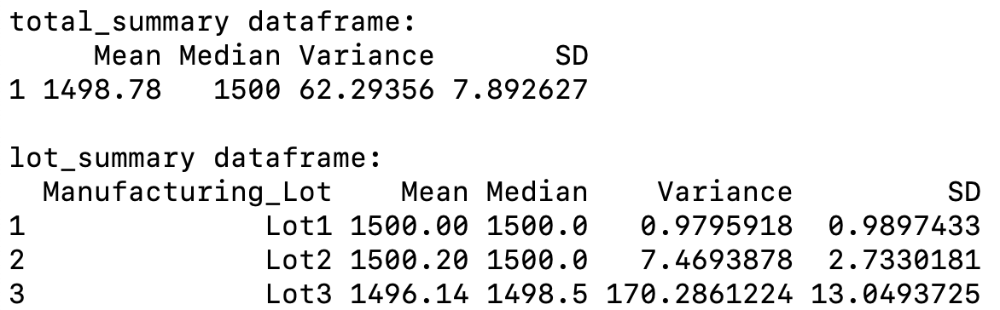
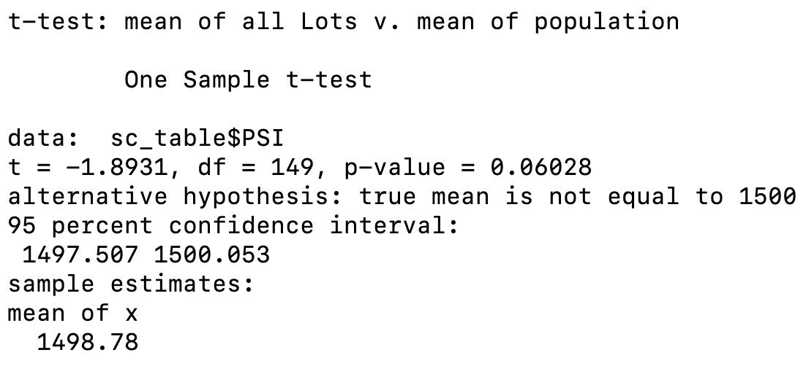
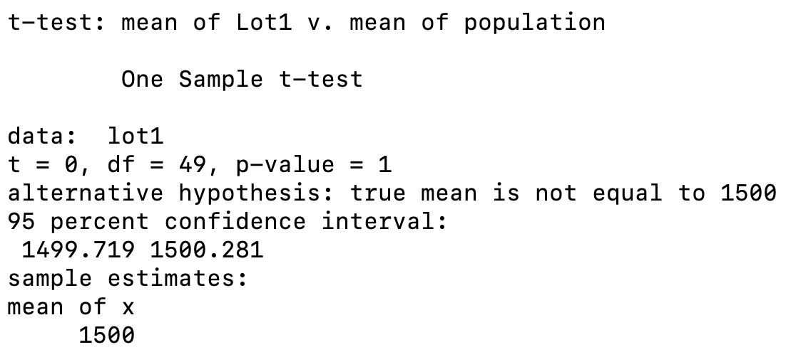
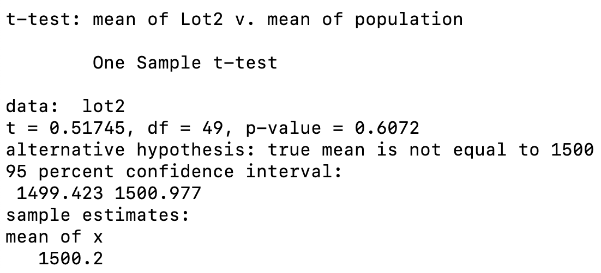
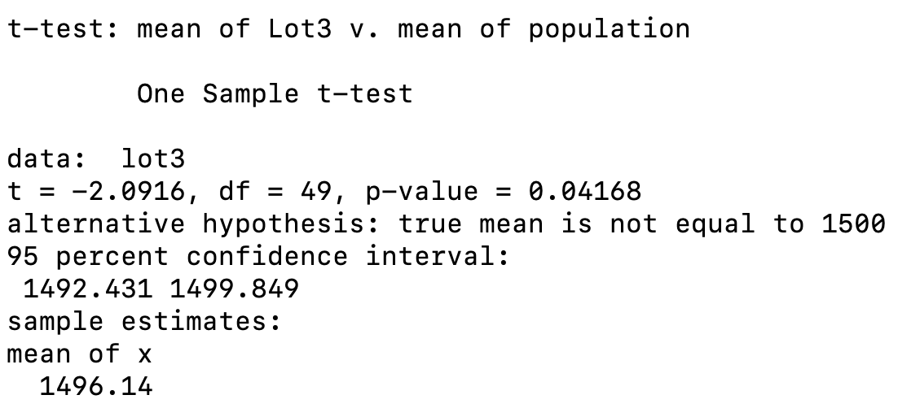

# MechaCar Statistical Analysis
Statistics and R

## Linear Regression to Predict MPG

The variables/features that provide a non-random amount of variance, i.e. those with significant p-values, are vehicle_length, ground_clearance, and intercept.

The slope of the linear model is non-zero, because the coefficients of vehicle_length (6.27) and ground_clearance (3.55) are non-zero.

The model is relatively effective in predicting the mpg of MechaCar prototypes, as the model explains 71% (Multiple R-squared = 0.71) of the variance of mpg. However, the significance of the intercept may mean that the significant features need transforming or that other features not included in the regression need to be included to improve the predictive power of the model.

Fig. Multiple linear regression on how mpg varies with vehicle_length, vehicle_weight, spoiler_angle, ground_clearance, and AWD.

## Summary Statistics on Suspension Coils

"The design specifications for the MechaCar suspension coils dictate that the variance of the suspension coils must not exceed 100 pounds per square inch."

- **total_summary.** The total_summary shows that the combined Lot variance is 62.3 pounds per square inch, which is within the design specifications.

- **lot_summary.** However, the lot_summary shows that Lot1 (variance = 0.980 pounds per square inch) and Lot2 (variance = 7.47 pounds per square inch) are within the design specifications, but Lot3 (variance = 170 pounds per square inch) exceeds the design specifications of 100 pounds per square inch.

Fig. The total_summary (above) and lot_summary (below) dataframes.

## T-Tests on Suspension Coils

One sample t-tests are used, because the comparison is between the mean of the population and the mean of a sample of that population. The mean of all Lots (1498.78, n=150, p=0.060), the mean of Lot1 (1500, n=50, p=1), and the mean of Lot2 (1500.2, n=50, p=0.607) are not significantly different from the population mean (1500). However, the mean of Lot3 (1496.14, n=50, p=0.042) is significantly different from the population mean (1500).

Fig. t-test: mean of all Lots v. mean of population.

---

Fig. t-test: mean of Lot1 v. mean of population.

---

Fig. t-test: mean of Lot2 v. mean of population.

---

Fig. t-test: mean of Lot3 v. mean of population.

## Study Design: MechaCar vs Competition

Here in Southeastern Michigan, we travel a lot by car in the wintertime. Snow and ice on the roads are a given. A study is proposed to test if the MechaCar performs better in winter weather driving conditions than the Competition. 

- **Metrics to test.** Testing is done on a reproducible "slippery course" where there is less friction between the road and the vehicle tires. By reproducible it is meant that the course has the same "slipperiness" for all tests on all cars. On real-world icy roads, consider 35 mph to be a maximum relatively safe speed for testing. In addition to novel transmission and braking technology, if the MechaCar has specially designed tires, then use those during testing as well, as they are part of the overall design of the car.
    - **Stopping distance 35 to 0 mph.** Stopping quickly is important to prevent rear-ending cars in front. It is also a proxy for slowing down when taking a curve or sliding during a turn.
    - **0 to 35 mph time.** Coming up to speed from a dead stop is important in slippery conditions. 

---

- **Hypotheses.** The two null hypotheses are that there are no statistically significant differences in stopping distance H(d,0) or 0 to 35 mph time H(t,0) between the MechaCar and the Competition. One pair of alternative hypotheses is that the stopping distance statistically significantly differs H(d,a1) or that the 0 to 35 mph time H(t,a1) statistically significantly differs between the MechaCar and the Competition. Another pair of alternative hypotheses is that the MechaCar has a statistically significantly shorter stopping distance H(d,a2) or a statistically significantly faster 0 to 35 mph time H(t,a2). See table below for a compact display of hypotheses.

| Abbr. | Type | t-Test | Description |
| --- | --- | --- | --- |
| H(d,0) | null | | no difference in stopping distance |
| H(t,0) | null | | no difference in 0 to 35 mph time |
| H(d,a1) | alt. | two-sided | stopping distance differs |
| H(t,a1) | alt. | two-sided | 0 to 35 mph time differs |
| H(d,a2) | alt. | one-sided | MechaCar stopping distance is less than Competition |
| H(t,a2) | alt. | one-sided | MechaCar 0 to 35 mph time is less than Competition |

Table of the abbrebiation (column Abbv.) of the hypothesis, the type (column Type) of hypothesis as either null or alternative (alt.), the type of two-sample t-test (column t-Test) as either two-sided or one-sided, and a short description of the hypothesis regarding comparison of the MechaCar and the Competition metrics.

---

- **Statistical tests.** The metrics chosen to measure are mean stopping distance from 35 to 0 mph and mean 0 to 35 mph time for the MechaCar and the Competition. To compare means between a sampling of MechaCars and a sampling of the Competition one uses a two-sample t-test. To compare a difference in means, use a two-sided t-test. To test whether the MechaCar sample has a smaller mean than the Competition, use a one-sided test. A p-value less than 0.05 indicates that the null hypothesis should be rejected and the alternative hypothesis accepted. Here are the two-sample t-tests to use in R for the four hypotheses in question:

    - **H(d,a1) v. H(d,0):** `t.test(x=MechaCar.stopping_distance, y=Competition.stopping_distance, alternative=two.sided)`
    - **H(t,a1) v. H(t,0):** `t.test(x=MechaCar.0_to_35, y=Competition.0_to_35, alternative=two.sided)`
   - **H(d,a2) v. H(d,0):** `t.test(x=MechaCar.stopping_distance, y=Competition.stopping_distance, alternative=less)`
    - **H(t,a2) v. H(t,0):** `t.test(x=MechaCar.0_to_35, y=Competition.0_to_35, alternative=less)`

---

- **Data required.** Choose a sample of 10 MechaCars and a sample of 10 Competition cars. Have each car perform, on the reproducibly "slippery course," 10 trials of each of the two metics, stopping distance from 35 to 0 mph and 0 to 35 mph time. In this way there will be 100 data points for each car and each metric. If more data is needed, sample more cars and/or run more trials per car.

