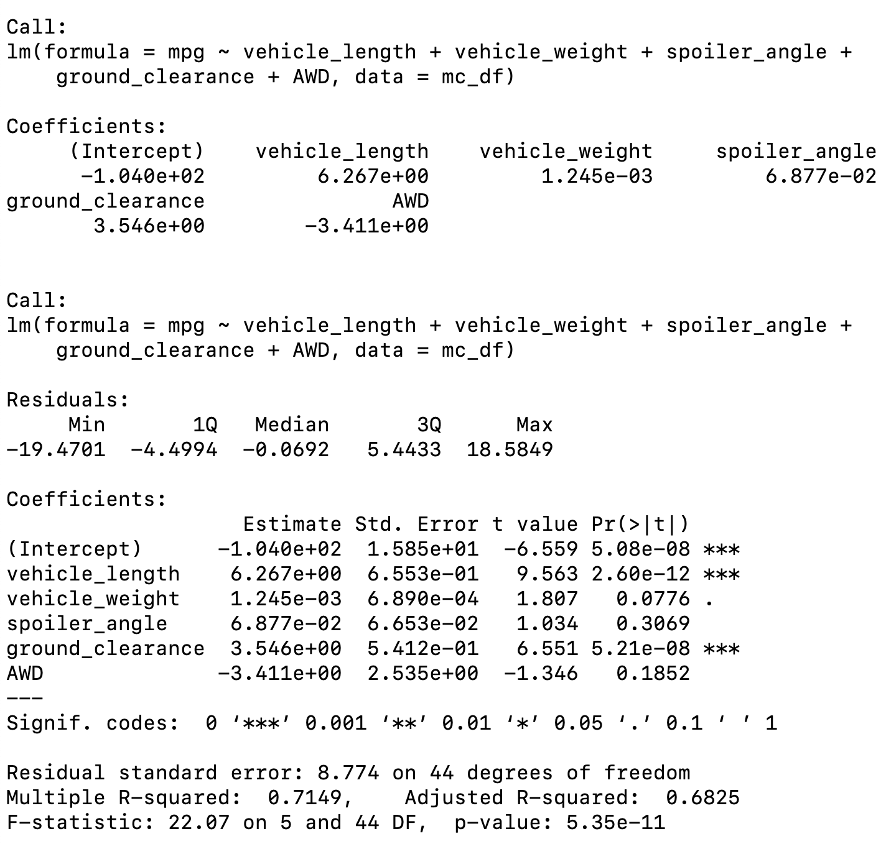

# MechaCar_Statistical_Analysis
Statistics and R

## Linear Regression to Predict MPG

The variables/features that provide a non-random amount of variance, i.e. those with significant p-values, are vehicle_length, ground_clearance, and intercept.

The slope of the linear model is non-zero, because the coefficients of vehicle_length (6.27) and ground_clearance (3.55) are non-zero.

The model is relatively effective in predicting the mpg of MechaCar prototypes, as the model explains 71% (Multiple R-squared = 0.71) of the variance of mpg. However, the significance of the intercept may mean that the significant features need transforming or that other features not included in the regression need to be included to improve the predictive power of the model.

Fig. Multiple linear regression on how mpg varies with vehicle_length, vehicle_weight, spoiler_angle, ground_clearance, and AWD.

## Summary Statistics on Suspension Coils

## T-Tests on Suspension Coils

## Study Design: MechaCar vs Competition

When an intercept is statistically significant, it means that the intercept term explains a significant amount of variability in the dependent variable when all independent vairables are equal to zero. Depending on our dataset, a significant intercept could mean that the significant features (such as weight and horsepower) may need scaling or transforming to help improve the predictive power of the model. Alternatively, it may mean that there are other variables that can help explain the variability of our dependent variable that have not been included in our model. Depending on the dataset and desired performance of the model, you may want to change your independent variables and/or transform them and then re-evaluate your coefficients and significance.